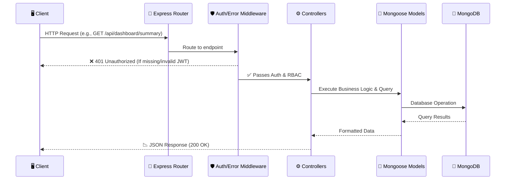

<div align="center">
  
# ❇️ Zrovyn Backend

**A lightweight, scalable Express.js backend for managing users, financial records, and dashboard analytics.**

[](https://nodejs.org/)
[](https://expressjs.com/)
[](https://www.mongodb.com/)
[](https://jwt.io/)

</div>

---

## 📖 Overview

Zrovyn Backend is built using the **MVC (Model-View-Controller)** pattern, designed to handle financial tracking securely. It supports multi-tier Role-Based Access Control (RBAC), secure JWT authentication, and provides aggregated dashboard summaries for a frontend client.

## ✨ Features

- **🔐 Secure Authentication:** JWT-based stateless authentication with hashed passwords using `bcryptjs`.
- **🛡️ Role-Based Access Control (RBAC):** Three distinct user roles (`Admin`, `Analyst`, `Viewer`) with precise access scopes.
- **📊 Financial Tracking:** Comprehensive API to manage income and expense records.
- **📈 Dashboard Analytics:** Aggregated endpoints returning dynamic analytics based on user records.
- **🚀 In-Memory DB Support:** Automatically falls back to an in-memory MongoDB instance if no local instance is provided, ensuring zero-configuration setups.

---

## 🏗 System Architecture & Flow

The application follows a clean, decoupled architecture ensuring maintainability and scalability.



---

## 📂 Project Structure

```text
Zrovyn-Backend/
├── src/
│   ├── app.js                 # 🚀 Express App Initialization
│   ├── config/
│   │   └── db.js              # 💾 Database Connection Logic
│   ├── controllers/           # ⚙️ Business Logic (Auth, Users, Records, Dashboard)
│   ├── middlewares/           # 🛡️ Custom Auth and Error Handlers
│   ├── models/                # 📄 Mongoose Schemas (User, Record)
│   ├── routes/                # 🚏 API Route Definitions
│   └── utils/                 # 🛠️ Helper Functions & Utilities
├── server.js                  # ⚡ Application Entry Point
├── package.json               # 📦 Dependencies and Scripts
└── README.md                  # 📖 Project Documentation
```

---

## 🛠 Technology Stack

| Technology | Purpose |
| :--- | :--- |
| **Node.js + Express** | Core runtime and web server framework. |
| **MongoDB + Mongoose** | NoSQL database and Object Data Modeling (ODM). |
| **JWT (JSON Web Tokens)** | Secure transmission of information between parties. |
| **Bcryptjs** | Safely hashing and storing user passwords. |
| **Zod** | Schema declaration and robust input validation. |

---

## 🚦 Core API Endpoints

### 👤 Authentication (`/api/auth`)
- `POST /register` - Register a new user
- `POST /login` - Authenticate user & receive JWT
- `GET /me` - Get current user profile

### 🧑‍🤝‍🧑 Users (`/api/users`) - *Protected*
- `GET /` - List all users *(Admin only)*
- `PUT /:id/role` - Update user role *(Admin only)*
- `DELETE /:id` - Delete a user *(Admin only)*

### 💰 Records (`/api/records`) - *Protected*
- `GET /` - Get financial records
- `POST /` - Create a new record (Income/Expense)
- `PUT /:id` - Update an existing record
- `DELETE /:id` - Remove a record

### 📊 Dashboard (`/api/dashboard`) - *Protected*
- `GET /summary` - Retrieve aggregated financial summaries (total income, expenses, balance).

---

## ⚙️ Getting Started

### 1️⃣ Clone the Repository & Install Dependencies

```bash
npm install
```

### 2️⃣ Configure Environment Variables

Create a `.env` file in the root directory and add the following variables:

```env
PORT=5000
NODE_ENV=development
JWT_SECRET=your_super_secret_jwt_key
JWT_EXPIRES_IN=90d
MONGODB_URI=your_mongodb_connection_string # Optional
```

> **Note:** If `MONGODB_URI` is left blank or undefined, the application will automatically boot up an in-memory MongoDB database to get you started immediately!

### 3️⃣ Start the Application

**Development Mode** (with auto-reload via nodemon):
```bash
npm run dev
```

**Production Mode**:
```bash
npm start
```

The server will be running at `http://localhost:5000`.

---

## 🛡 Role-Based Access Control (RBAC) Details

- **Admin:** Has full access. The *first registered user* automatically receives the `Admin` role. Admins can manage other user roles and view all records.
- **Analyst:** Can view aggregate dashboard data and manage/view their own records.
- **Viewer:** Read-only access to their own dashboard data and records. Cannot create, edit, or delete records.
